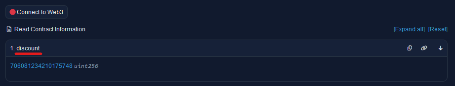
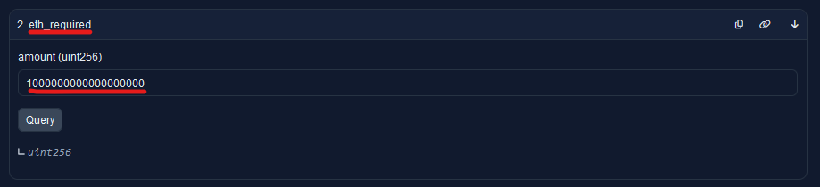

# Yearn Protocol Documentation Website

The yearn devdocs [website](https://docs.yearn.fi/) is built using [Docusaurus](https://docusaurus.io/), a modern static website generator.

## Installation

```console
yarn install
```

## Local Development

```console
yarn start
```

This command starts a local development server and opens up a browser window. Most changes are reflected live without having to restart the server.

## Build

```console
yarn build
```

This command generates static content into the `build` directory and can be served using any static content hosting service.

## Deployment

```console
GIT_USER=<Your GitHub username> USE_SSH=true yarn deploy
```

If you are using GitHub pages for hosting, this command is a convenient way to build the website and push it to the `gh-pages` branch.

## Configure .env

The docs site pulls data from on-chain smart contracts, so an API key is necessary. The default is an Alchemy API key so the easiest thing to do is get a free api key from them at https://www.alchemy.com/pricing.

Rename the `.env.example` file in the root directory to `.env` and add your API key where it says "yourApiKeyHere" without any quotes or backticks.

If you would like to use a different RPC service, or your own node to pull blockchain data, you can edit the publicClient in `/src/context/PublicClientContext`.

## Contribute

### Documentation Structure

We have 2 types of documentation: versioned documentation and non-versioned documentation:

- Versioned documentation is automatically generated from another repository's code.
- Non-versioned documentation is generated from markdown or HTML files and edited manually.

For detailed information on the contributing workflow, please see the [Contributing Documentation](CONTRIBUTING.md).

#### Non-versioned Documentation

In the `docs` folder:

- getting-started
- partners
- v1

#### Versioned Documentation

Versioning has changed. Because Yearn supports multiple products with their own versions, versioning is now done manually using folder structure to keep things organized. There are folders for all versions of the smart contract [NatSpec](https://docs.soliditylang.org/en/latest/natspec-format.html) documentation in:

```

docs/developers/smart-contracts
                    |---- V3 Current (v3.x.x)
                    |           |--- contract 1 
                    |           |--- contract 2
                    |           |--- contract n... 
                    |           
                    |---- V3 Deprecated 
                    |           |--- v3.x.x
                    |           |     |--- contract 1 
                    |           |     |--- contract 2
                    |           |     |--- contract n... 
                    |           |--- v3.x.x
                    |                |--- contract 1 
                    |                |--- contract 2
                    |                |--- contract n... 
                    |           
                    |---- V2 Current (v0.4.6)
                    |           |--- contract 1 
                    |           |--- contract 2
                    |           |--- contract n... 
                    |           
                    |---- V2 Deprecated 
                    |           |--- v0.4.5
                    |           |     |--- contract 1 
                    |           |     |--- contract 2
                    |           |     |--- contract n... 
                    |           |--- v0.x.x
                    |                |--- contract 1 
                    |                |--- contract 2
                    |                |--- contract n... 

```

### Generating V2 Versioned Documentation

#### Dependencies

- Clone [yearn/yearn-vaults](https://github.com/yearn/yearn-vaults) in the same folder where you cloned yearn-devdocs (not inside devdocs, but besides it)
- Run the yearn-vaults [installation](https://github.com/yearn/yearn-vaults#installation), you will need to have brownie installed to run it once so it installs the required dependencies.
- Check the vyper compiler version on the vaults repo ([here](https://github.com/yearn/yearn-vaults/blob/master/contracts/Vault.vy#L1)) and update the `~/.vvm/vyper-X.X.X` in the end of the first command below.
- Make sure [Vault.vy](https://github.com/yearn/yearn-vaults/blob/master/contracts/Vault.vy#L1) and [Registry.vy](https://github.com/yearn/yearn-vaults/blob/master/contracts/Registry.vy#L1) on `yearn-vaults` folder has the same compiler version on their first line. If not, bump the file with the lowest version to the current version the other uses.
- If any contract file in yearn-vaults uses a fixed compiler version (without leading `^`) you may have to add it so the `solc` compiler will run. Also, make sure `solc` version is up-to-date.
- If you get errors with global `solc` try to install it locally on the project with npm

**Generate:**

To generate API documentation and coin a new release, do the following.

1. Generate docs from contracts using vydoc or similar documentation creator.
2. Create new "current" folder in "docs/developers/smart-contracts/v2/current-<newVersion#>"
3. Copy new docs into newly created folder.
4. rename and move deprecated docs folder into deprecated folder

:warning: Here are the old instructions to create vydoc documentation. They may need updating.

```bash
npx vydoc -i ../yearn-vaults/contracts/ -o ./vaults/smart-contracts -t ./templates/contract.ejs -c ~/.vvm/vyper-0.3.3
```

```bash
npx solidity-docgen@0.5.17 --solc-module solc --templates=templates --helpers=helpers/solidityHelpers.js -i ../yearn-vaults/contracts/ -o ./docs/developers/smart-contracts/V2
```

```bash
npm run docusaurus docs:version 0.4.5
```

If you are developing in Solidity and Foundry you can use `[forge-doc](https://book.getfoundry.sh/reference/forge/forge-doc)`

### Custom Elements

#### Detail Element

This is a Detail element that contains other text inside. If you format the summary section as shown it renders markdown correctly.

```
<details className="customDetails">

  <summary>
  
  ## Title Here
  
  </summary>

### Subtitles as needed

content here

</details>
```

There is also a "customFaqDetails" css class that removes the borders.

#### PrettyLink

The PrettyLink element makes your links into button-like elements with subtle animation and yearn styling. These links will fill the full width of the markdown document. Can be used with naked links or with markdown style links.

```
<PrettyLink>[your link name](your-link-url)</PrettyLink>
```

#### Yearn Admonition

There is a custom informational Yearn-styled admonition that can be used like any other admonition.

```
:::yearn-info[title-goes-here]

text content

:::
```

### Blockchain RPC Calls

You can make RPC calls to read contract data from on-chain sources and display them within the docs. This is done using the Viem ethereum library. But if all you are doing is writing docs, you don't need to worry about the details here. You can add the information for all the read calls you want within the front-matter of a markdown document. [Front-matter](https://docusaurus.io/docs/markdown-features#front-matter) is metadata that docusaurus reads when serving pages.

To make a blockchain call you need to structure your data in the following format:

```yml
---
rpcCalls:

  - name: 'dYFI Redemption' <-- descriptive name of contract to be called for use in component
    chain: '1' <--chainID
    address: '0x7dC3A74F0684fc026f9163C6D5c3C99fda2cf60a' <--the contract address
    abiName: 'dyfiRedemptionABI' <--name of exported ABI object from src/ethereum/ABIs
    methods:  
      - 'discount' <-- name of call (if no arguments needed)
      - 'get_latest_price'
      - name: 'eth_required' <-- name of call (if arguments are needed)
        args: ['1000000000000000000'] <--comma separated arguments of call as an array (square brackets)

  - name: 'YFI token'
    chain: '1'
    address: '0x0bc529c00C6401aEF6D220BE8C6Ea1667F6Ad93e'
    abiName: 'yfiTokenABI'
    methods:
      - totalSupply
      - symbol
---
```

- Each element in rpcCalls creates an object that is exported from the front-matter.
- Each object can contain calls to different functions in the same contract if you add them into the methods field.
  - If the method doesn't require args (the function doesn't require any input) then you only need to list the name. This is the name you see on etherscan, without the number.
  - If the method does require an argument then you need to add it with a name parameter and an args parameter, with the values for the arguments separated by commas and in square brackets.





⚠️ When adding a new contract to call, you need to add the ABI to "src/ethereum/ABIs". Create a new typescript file with the name of your ABI. The convention is to name it in camelCase and end it with ABI (i.e. yfiTokenABI.ts). Then paste the ABI into the file (you can copy it from etherscan. It is in the contract->code section.). You need to export it and add `as const` at the end.

```js
// src/ethereum/ABIs/yourContractABI.ts
export const yourContractABI = [
    {
    // abi data here
    }
] as const

```

You then need to export this element from the index.ts file in the same directory. Add a line exporting your ABI as shown below.

```js
export * from './yourContractABI'
```

To display the data from the calls, use the \<ContractData> component. It takes the following arguments:

- `contractName` which reads the name field in the rpcCall defined in the front-matter
- `methodName` which reads from the methods in the rpcCall defined in the front-matter
- `decimals` which is an optional argument to format your output to display with human readable decimals. It should be wrapped in curly brackets \{\}.

```markdown
The current redemption discount is: <ContractData contractName='dYFI Redemption' methodName='discount' decimals={18} />
```
