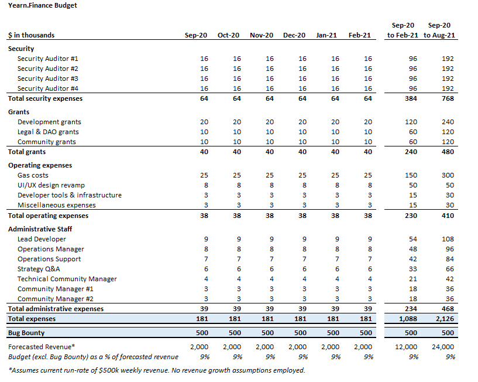

# YIP-41: Temporarily Empower Multisig

| Metadata | Details |
| --- | --- |
| YIP | 41 |
| Outcome | **Passed** |
| Authors | tracheopteryx, Substreight, franklin501, Michael Anderson, Vance Spencer |
| Created | 2020-08-24 |
| Forum discussion | [View discussion](https://gov.yearn.fi/t/empower-the-multisig/2891) |
| Snapshot vote | Not recovered |
| Vote result | No Snapshot vote recovered. |
| Source | [Source](https://github.com/yearn/YIPS/blob/master/YIPS/yip-41.md) |

## Summary

Temporarily empower the Multisig members to make basic, limited operational decisions including budgetary expenditures, protocol grants, and hiring for six months, as we prepare a more robust governance architecture.

## Abstract

The proposed change would allow Multisig members to make personnel & budgetary decisions for no more than six (6) months. Any budget is to be proposed to governance for approval. This change would allow operational decisions to be made at a rapid pace for the next six (6) months. During this six-month term, the Multisig will be responsible for facilitating the creation and transition to a multi-DAO structure. These powers, as well as members of the Multisig, can be removed or modified by governance at any time.

## Motivation

In this nascent stage of Yearn's lifetime, it is crucial to make rapid decisions in order to establish a strong foundation. Structure and support needs to be quickly built around Andre’s development speed in order to ensure the success of the protocol. This proposal formalizes administrative roles that will serve as a foundation for the protocol’s transition to a multi-DAO structure in the near term.

## Specification

### Overview

This proposal grants the Multisig operational authority on the following decisions for six (6) months from implementation:

- Determining and distributing protocol grants.
- Determining and distributing community grants.
- Determining and distributing legal + DAO consultation grants.
- Identifying and executing key hires listed on the attached budget.
- Identifying and engaging security firms.
- Identifying and engaging analytical firms.
- Continue executing yVault strategy changes until a dedicated team can take over.
- Facilitating UI & front-end development.
- Facilitating business development and integrations.

This proposal does not grant the Multisig:

- Authority over YFI token or emissions.
- Leadership powers beyond those described above.
- Any powers over the YIP process or governance.
- Authority over the composition of the Multisig group -- any changes to Multisig signers will need to be approved by governance.
- The power to ignore or hinder any approved YIPs or the governance process in general.
- The power to create a legal entity.

### Rationale

Forum Poll (202 votes)

- 78% “Yes, empower the Multisig”
- 22% “No, find a better solution”

Important objections raised in the forum poll argued against moving to a foundation model and overly centralizing powers. Here is how we’re learning and adjusting from this feedback:

- Clarification that this proposal is not for a foundation model and that the yearn governance DAO will retain its dominant authority including the ability to modify or remove the multisig’s members or powers via future on-chain votes.
- A deeper discussion about decentralization, governance, and the urgency for this YIP to pass can be found in this thread: [Understanding Decentralization & Prioritizing an Operations Team](https://gov.yearn.fi/t/understanding-decentralization-prioritizing-an-operations-team/3396).
- Clearer limitations on the multisig’s authority detailed above to be controlled via smart contract.

### Technical Specification

**For:** Empower the Multisig for six (6) months.

**Against:** No changes.

### Proposed Budget

