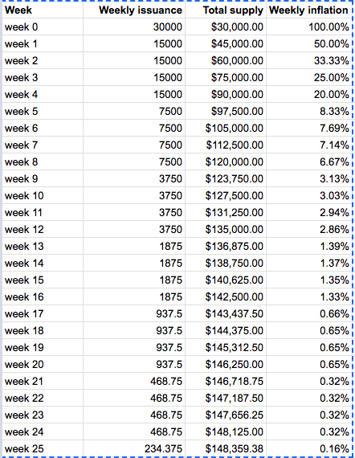

# YIP-5: Reducing YFI weekly supply

| Metadata | Details |
| --- | --- |
| YIP | 5 |
| Outcome | **Rejected** |
| Authors | sikiriki12 |
| Created | 2020-07-20 |
| Forum discussion | [View discussion](https://gov.yearn.fi/t/proposal-5-reducing-yfi-weekly-supply/110) |
| Snapshot vote | Not recovered |
| Vote result | No Snapshot vote recovered. |
| Source | [Source](https://github.com/yearn/YIPS/blob/master/YIPS/yip-5.md) |

## Simple Summary

Currently the weekly supply increase of YFI is 30,000 per week. Vote under proposal #0 is if more YFI tokens should be minted.

I’m voting “FOR” on proposal #0 as I think continuous incentivization of LPs is important for growth of the platform.

However I also think early participants of the platform that are taking more risk should be rewarded with a higher % of YFI supply.

This is a proposal for reducing the weekly issuance rate with a simple halvening model similar to that of BTC but accelerated due to the significant interest in the platform (so a long discovery period is not necessary) and with a inflation floor to always have some level of incentive to attract new users to the platform.

So issuance week 0 is 30,000. Issuance week 1 should be halved to 15,000. (5k per pool). After that every 4 weeks the rewards should half to 7,500 starting from week 5, 3,750 starting week 9, 1,875 starting week 13, 937.5 starting week 17, 468.75 starting week 21 and final halvening in week 25 to a long term issuance rate of 234.375.

In summary. If proposal #0 passes the issuance model should be altered as described above.

**FOR**: Support the new issuance model.

**AGAINST**: Do not support the new issuance model.

## Metadata

| Name                | Value                                      |
| ------------------- | ------------------------------------------ |
| Proposed by         | 0x5398850A9399Da87624874704FEAa8A9C6C4089B |
| Total for votes     | 1123689.4842 (69.84%)                      |
| Total against votes | 485164.6894 (30.15%)                       |
| Quorum              | 6.19% 𐄂                                    |
| Start block         | 10496829                                   |
| End block           | 10514109                                   |

Source: [yieldfarming.info YFI Governance Information](https://yieldfarming.info/yearn/vote/)
