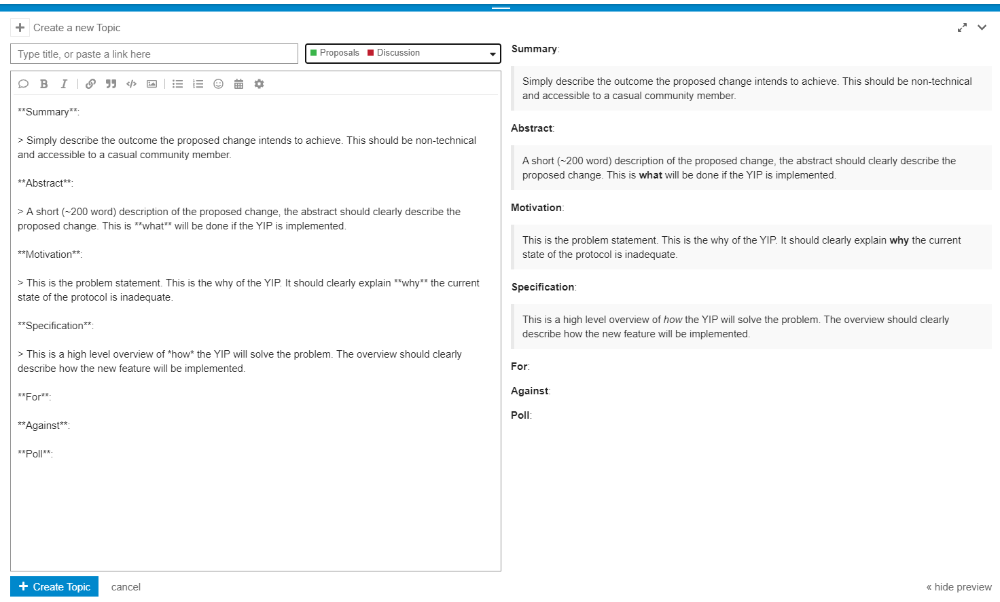

# YIP-55: Formalize the YIP Process

| Metadata | Details |
| --- | --- |
| YIP | 55 |
| Outcome | **Passed** |
| Authors | franklin, dudesahn |
| Created | 2020-11-12 |
| Forum discussion | [View discussion](https://gov.yearn.fi/t/yip-55-formalize-the-yip-process/7959) |
| Snapshot vote | [View vote](https://snapshot.org/#/s:yearn/proposal/QmZA8zJtLPqQAHi1jMdYX9MdMQ1ZmtRP8zuHccm6HFSzpF) |
| Vote result | Snapshot record recovered; detailed scores are unavailable from the current API. |
| Source | [Source](https://github.com/yearn/YIPS/blob/master/YIPS/yip-55.md) |

## Summary

The purpose of this proposal is to standardize the Yearn Improvement Proposal (YIP) introduction, voting, and implementation process that governs the Yearn Finance protocol.

## Abstract

This proposal formalizes the process for introducing, voting, and implementing YIPs. Valid proposals are to be discussed for at least 3 days on Yearn’s [governance forum](https://gov.yearn.fi/) 6 and include a forum poll to gauge sentiment. If after three days there is a 25% “For” vote in the forum poll it will then move to formal voting via Snapshot. In order for a vote to pass it must have a majority support (> 50%) after at least five days of voting. Following a successful vote, necessary changes will be implemented by Yearn’s protocol or operations team and signed by the multi-sig, if necessary. Changes to this policy, including quorum requirements or what constitutes a majority vote, can only be enacted by a valid YIP that overwrites this policy.

## Motivation

Although there are several informal standards governing the YIP introduction, voting, and implementation process there is no single, clear policy. Recent proposals have not followed the quorum requirement defined in [YIP-12](/contributing/governance/yips/yip-12) 5. Additionally, no YIP or formal policy has been implemented that specifies votes conducted via Snapshot are formal and binding. This YIP would define and formalize the process in order for proposals to be valid and binding, and reduce any confusion in the YIP introduction and voting process.

## Specification

**_Introducing the YIP_**

In order to submit a potential YIP for voting a user must first create a thread for the proposal on the Yearn governance forum (https://gov.yearn.fi). Complete the auto-populated fields that appear when creating a proposal on the forum. A screenshot of these fields are below:

Additionally, the thread should include a poll from the governance forum to gauge interest from the wider governance community. After the thread has been on the governance forum for at least 3 days and has received over 25% “For” votes it can proceed to formal voting via Snapshot. This allows the community to suggest potential changes to the proposal before it moves to the formal voting phase on Snapshot. Please do not assign your proposal a YIP number; numbers will be assigned by moderators prior to a vote taking place.

If a proposal was introduced on the governance forum and achieved at least a 25% “For” from the poll but is not submitted to Snapshot within 30 days, the author of the proposal must re-submit the proposal to the governance forum and restart the process. This ensures that proposals that previously received support from governance still retain support from the community.

**_Formal Voting Phase_**

Snapshot is used for formal, binding votes. The user who authored the YIP will also create the Snapshot proposal using this link ([Snapshot](https://snapshot.page/#/yearn) 8). Snapshot requires 1 YFI in a user’s wallet to create a proposal. If the author does not meet this requirement then contact a moderator who will submit the proposal on your behalf. Before creating the Snapshot vote, please wait for a moderator to assign your YIP a number and begin your Snapshot title with it.
A previous version of this proposal called for a minimum of 72 hours for voting, and a 20% quorum requirement. In response to feedback that a quorum requirement might be difficult to quantify and could lead to time-consuming rallying of apathetic voters, we have instead opted to extend the minimum voting window to 120 hours (5 days), with a maximum length of 7 days. This extension period, coupled with an active communication of YIPs via the governance forums and on social media should help ensure that no YIPs slip by, or malicious ones are approved. 5 days is sufficient time for the wider community to participate.

The block selected for the Snapshot vote should be a block close to the Snapshot submission. In order for a vote to pass it needs to have a majority approval (>50%) by eligible voters. The eligible vote is defined as YFI held in the governance staking contract and the yYFI vault at the time the vote is proposed on Snapshot. If the Snapshot vote does not meet a 50% majority approval then the vote is rejected and no changes will be enacted. Authors of proposals that are rejected may resubmit their proposal, but should include significant changes that address issues that may have prevented the YIP from passing during the initial vote.

### Scope

This specification aims to clarify which proposals should move to the YIP stage, how long they should be discussed for, and how long the vote should be open for. By only allowing proposals to move to YIP/voting after several days of discussion, we ensure that everyone’s voice is heard, and proposals should more accurately reflect community consensus.

Additionally, while some may think that three days is too short to adequately discuss a proposal, this is simply the minimum requirement. We expect most discussions to last for significantly longer than this (as they have in the past), with only a select few well-planned and researched proposals with near unanimous approval moving through so quickly. This proposal also will not stifle the open source protocol improvements that are made daily by dozens of Yearn’s contributors. It only aims to govern those proposals that seek community feedback and ratification as YIPs.

**_Other Uses for Snapshot_**

Snapshot may still be used for informal signal voting, including community contests, but its primary purpose will be to conduct formal, binding votes.

## TL;DR

1. All proposals must be discussed for at least 3 days with a forum poll before they will be assigned a YIP number and move to Snapshot voting.
1. The Snapshot vote will be binding, and must be open for at least 5 days. At least 50% must vote “For” the proposal for it to pass.
1. Most open-source protocol updates do not require YIPs; this process only governs those changes or proposals that wish to be discussed and enacted as YIPs.

**For**: Formalize the YIP introduction, voting, and implementation process as specified above

**Against**: Do not formalize the process. No changes made.

## Authors

@franklin @dudesahn
