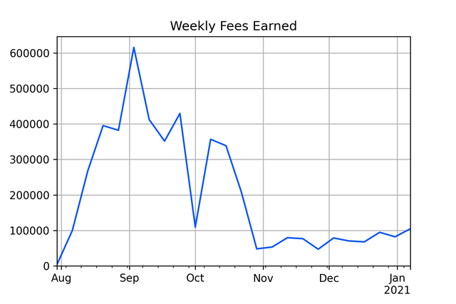

# YIP-56: BABY:\ Buyback and Build Yearn

| Metadata | Details |
| --- | --- |
| YIP | 56 |
| Outcome | **Passed** |
| Authors | banteg, lex-node, lehnberg, milkyklim, tracheopteryx, RyanWatkins |
| Created | 2021-01-16 |
| Forum discussion | [View discussion](https://gov.yearn.fi/t/yip-56-buyback-and-build/8929) |
| Snapshot vote | [View vote](https://snapshot.org/#/s:yearn/proposal/Qmb6gBzjvgLMazSrQQGVcjutLNdkVyM2Lh6yckMzdoaHWZ) |
| Vote result | Yes: 790.83; No: 4.47 |
| Source | [Source](https://github.com/yearn/YIPS/blob/master/YIPS/yip-56.md) |

## Authors

[@banteg](https://gov.yearn.fi/u/banteg), [@lex_node](https://gov.yearn.fi/u/lex_node), [@lehnberg](https://gov.yearn.fi/u/lehnberg), [@milkyklim](https://gov.yearn.fi/u/milkyklim), [@RyanWatkins](https://gov.yearn.fi/u/ryanwatkins), [@tracheopteryx](https://gov.yearn.fi/u/tracheopteryx)

## Summary

Use YFI staking rewards to buy back YFI on the open market. Use bought back YFI for contributor rewards and other Yearn initiatives. Retire the YFI governance vault as it no longer has a use, opening up for it to be replaced in the future with a regular vault. Make it possible to participate in Governance even if one's YFI is being used elsewhere.

## Abstract

If adopted, this proposal seeks to:

1. Replace YFI staking rewards with YFI buybacks, until further notice.
2. Enable YFI that's actively being used in ways that bring benefit to Yearn to participate in Governance.
3. Retire the YFI governance vault (yGov).

This benefits Yearn as a whole by:

- Simplifying Treasury design and operation.
- Simplifying YFI token mechanics to equally align interests across Yearn stakeholders.
- Builds up a treasury of YFI that can be deployed through Governance for various uses.

This benefits YFI holders in particular by:

- Removing the need to stake YFI to enjoy rewards; in contrast to staking (which only benefits stakers), buybacks should benefit every YFI holder.
- Potentially making gains more tax efficient as capital appreciation through buybacks could be taxed less than dividend income through staking rewards.
- Allowing participation in YFI Governance even whilst the YFI tokens are utilized elsewhere, for example providing liquidity in SushiSwap.

## Motivation

### Previous proposals

This proposal comes on the back of previously made proposals and YIPs:

- The adoption of YIP-54[[1]](https://gov.yearn.fi/t/yip-56-buyback-and-build/8929#References) formalized an Operations Fund and allowed for discretionary YFI buybacks.
- [@RyanWatkins](https://gov.yearn.fi/u/ryanwatkins) proposed a rethink of Yearn's capital allocation strategy.[[2]](https://gov.yearn.fi/t/yip-56-buyback-and-build/8929#References) Arguing for protocol rewards to be used to buy back YFI rather than to reward YFI stakers, distributing protocol income as dividends would be a suboptimal capital allocation strategy given Yearn's stage of maturity. Instead, the proposal claimed it would be more optimal to use income to drive growth and asset appreciation instead.
- [@dudesahn](https://gov.yearn.fi/u/dudesahn) called for the existing Governance vault and strategy to be replaced with more conventional investment strategy.[[3]](https://gov.yearn.fi/t/yip-56-buyback-and-build/8929#References) Utilizing MakerDAO to mint DAI, this would be used for liquidity mining. One part of the returns would be rewarded to stakers, and the other would be used to fund Yearn's Bug Bounty program and yAcademy.
- Joel Monegro (Placeholder VC) recently published the essay "Stop Burning Tokens -- Buyback And Make Instead"[[4]](https://gov.yearn.fi/t/yip-56-buyback-and-build/8929#References) where he suggested that protocols should buy back and reissue tokens to incentivize growth rather than buying back and burning tokens to return value to token holders. This buyback strategy could be especially well suited for Yearn as the YFI supply is capped at 30,000, meaning that the initial conditions for Yearn's wealth distribution have been set, and no YFI can be further issued to incentivize growth. Such a "Buyback and Make" strategy could allow Yearn to receive the benefits of YFI inflation without any inflation.

### Rationale

_Figure 1. Staking rewards earned over time (USD).[[5]](https://gov.yearn.fi/t/yip-56-buyback-and-build/8929#References)_

#### Replace staking rewards with buybacks

- More suitable at this stage in the lifecycle. It is unconventional to pay out returns in the form of staking rewards this early in a project's lifecycle. Typically this would happen at a stage where funds no longer can be allocated efficiently.
- Better aligns with YFI's use case. YFI is primarily intended to be used for the governance of Yearn. Token mechanics should cater to those who take interest in the protocol and wish to actively participate in its improvement, over those looking to passively collect staking income.
- Potentially more tax-efficient for YFI holders. The gains on YFI staking may be treated as ordinary income. In contrast, a buyback program enables growth in YFI while YFI holders should only be taxed on a capital gains basis for a sale. Results may vary by jurisdiction and this does not constitute tax advice; consult your own tax advisor.
- Recycles YFI that can be spent through Governance. The resulting accumulation of YFI in the Treasury could enable future governance proposals on the use of this YFI for the further benefit of Yearn.

#### Widen YFI accepted for Governance voting

- Acknowledge more uses of YFI for the benefit of Yearn. There are other ways than holding YFI in your wallet that can benefit Yearn, for example by providing liquity to a YFI pair on SushiSwap. These YFI are not allowed to vote in Governance today, but they should be.
- Remove capital efficiency and governance trade-offs. Similarly, there shouldn't need to be a trade-off between participating in Governance or utilizing YFI efficiently.

#### Retire the yGov vault

- Vault no longer needed. Without staking rewards, there is no need for a yGov staking vault that's tied to Governance.
- Staking returns are aenemic. At the time of this writing, the APY estimate is 0.9% annually [[6]](https://gov.yearn.fi/t/yip-56-buyback-and-build/8929#References). This is not competitive, and may even dissuade YFI holders from participating in governance. In comparison, Binance recently announced up to 4.49% APY for staking YFI.[[7]](https://gov.yearn.fi/t/yip-56-buyback-and-build/8929#References).

### Future possibilities

- Introduce contributor retention program, with vesting YFI rewards to create long term skin-in-the-game for existing and new contributors.
- Re-introduce dividends once Yearn has matured and protocol income no longer can be re-invested as efficiently into growth.
- Introduce a conventional vault for YFI, using the v2 vault design. Such a vault would not be related to governance or staking rewards, and would be free to pursue other, to-be-determined strategies.

## Specification

### Replace staking rewards with buybacks

#### Buy back YFI

- All funds that are used for YFI staking rewards are to be used to buy back YFI. Staking rewards cease until further governance action.
- Buybacks should be handled in a continuous and automated way, and not be discretionary or requiring any sign-offs.
- Care should be taken to avoid creating arbitrage or front-running opportunities. Detailed specification of design is left to the developers implementing.

#### Use of bought YFI

- There are no changes in how funds are spent.
- The YFI bought back flows into the Operations Fund established by YIP-54 and can be spent accordingly.
- Example of current spends include: Security audits, Bug bounties, Contributor funding, Grants, Gas reimbursment, Development overhead. See the recently published quarterly financial report[[8]](https://gov.yearn.fi/t/yip-56-buyback-and-build/8929#References) for a detailed breakdown.

### Widen YFI accepted for Governance voting

- Link snapshot to use guest-list[[9]](https://gov.yearn.fi/t/yip-56-buyback-and-build/8929#References) to determine which YFI is eligible for voting.
- This functionality is already supported and excludes protocols such as Aave which could be utilized in governance attacks. The list of supported protocols is configurable and is being reviewed continuously, improvements and suggestions can be submitted to the repo.
- Any YFI in the Yearn Treasury / Operations Fund is not eligible to vote.

### Retire YFI Governance vault

- Retire the ygov.finance[[10]](https://gov.yearn.fi/t/yip-56-buyback-and-build/8929#References) staking vault and the YFI yVault YFIGovernance strategy that relies on it.

## Changelog

- Jan 13: Clarified voting specification to explicitly state that YFI in the treasury cannot be used to vote. [DL]
- Jan 16: Snapshot poll link added.

## References

1. [https://gov.yearn.fi/t/yip-54-formalize-operations-funding/](https://gov.yearn.fi/t/yip-54-formalize-operations-funding/)
2. [https://gov.yearn.fi/t/proposal-rethinking-capital-allocation/](https://gov.yearn.fi/t/proposal-rethinking-capital-allocation/)
3. [https://gov.yearn.fi/t/proposal-yfi-governance-vault-yacademy/](https://gov.yearn.fi/t/proposal-yfi-governance-vault-yacademy/)
4. [Stop Burning Tokens -- Buyback and Make Instead --- Placeholder 21](https://www.placeholder.vc/blog/2020/9/17/stop-burning-tokens-buyback-and-make-instead)
5. Data available upon request.
6. [yearn - stats.finance 6](https://stats.finance/yearn)
7. [Binance Staking Launches YFI Staking with Up to 4.49% APY | Binance Support 8](https://www.binance.com/en/support/announcement/de1dfcb0846a422a9d1f50f98ee0e8b8)
8. [yearn-pm/2020Q3-yearn-quarterly-report.pdf at master - iearn-finance/yearn-pm - GitHub 20](https://github.com/iearn-finance/yearn-pm/blob/master/financials/reports/2020Q3-yearn-quarterly-report.pdf)
9. [GitHub - banteg/guest-list 10](https://github.com/banteg/guest-list)
10. [https://ygov.finance/ 13](https://ygov.finance/)
