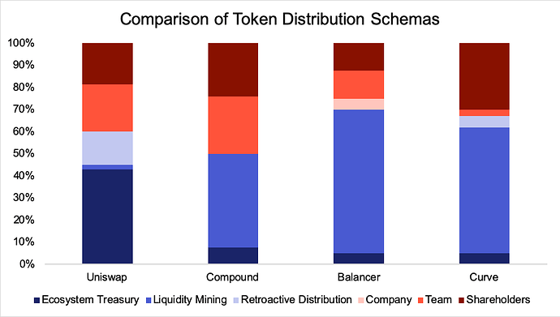
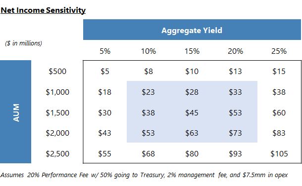
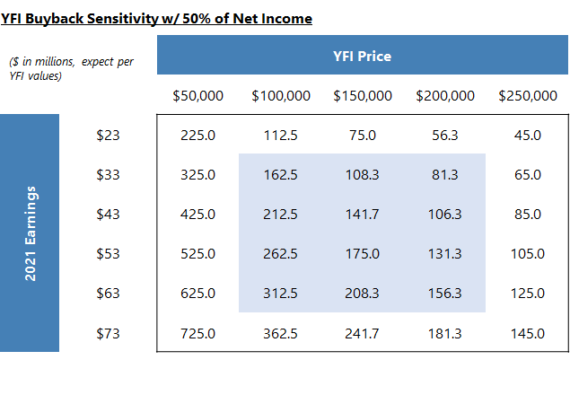
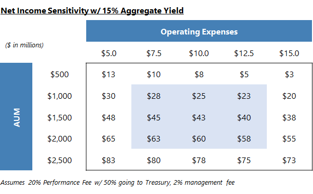
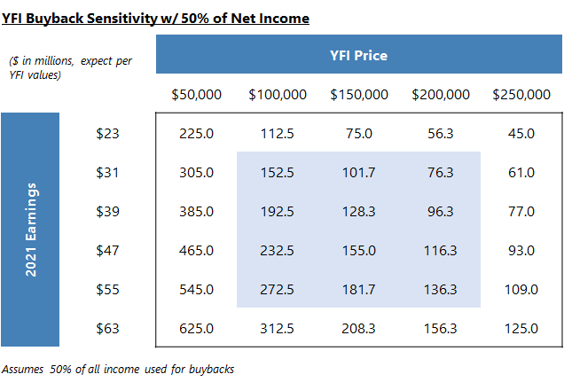

# YIP-57: Funding Yearn’s Future

| Metadata | Details |
| --- | --- |
| YIP | 57 |
| Outcome | **Passed** |
| Authors | aleks-blockchaincap, banteg, dudesahn, ekrenzke, lehnberg, ryanwatkins, srs-parafi, tracheopteryx, vooncer, yfi-cent, milkyklim |
| Created | 2021-01-28 |
| Forum discussion | [View discussion](https://gov.yearn.fi/t/yip-57-funding-yearns-future/9319) |
| Snapshot vote | [View vote](https://snapshot.org/#/s:yearn/proposal/QmX8oYTSkaXSARYZn7RuQzUufW9bVVQtwJ3zxurWrquS9a) |
| Vote result | Yes: 1,670.23; No: 331.03 |
| Source | [Source](https://github.com/yearn/YIPS/blob/master/YIPS/yip-57.md) |

## Authors

[@aleks-blockchaincap](https://gov.yearn.fi/u/aleks-blockchaincap), [@banteg](https://gov.yearn.fi/u/banteg), [@dudesahn](https://gov.yearn.fi/u/dudesahn), [@ekrenzke](https://gov.yearn.fi/u/ekrenzke) [@lehnberg](https://gov.yearn.fi/u/lehnberg), [@ryanwatkins](https://gov.yearn.fi/u/ryanwatkins), [@srs-parafi](https://gov.yearn.fi/u/srs-parafi), [@tracheopteryx](https://gov.yearn.fi/u/tracheopteryx), [@vooncer](https://gov.yearn.fi/u/vooncer), [@yfi-cent](https://gov.yearn.fi/u/yfi-cent), [@milkyklim](https://gov.yearn.fi/u/milkyklim)

## Summary

Safeguard Yearn's future development. Mint 6,666 YFI. Use ~1/3 of minted YFI to reward key contributors and put ~2/3 of minted YFI in the Treasury under the control of the community through future proposals.

## Abstract

If adopted, this proposal seeks to:

1. Mint 6,666 YFI.
2. Allocate ~1/3 of the minted YFI to key contributors as vesting retention packages.
3. Allocate the remaining ~2/3 to the Treasury, which will be deployed through existing Governance for various uses, for example:
   - Future contributor incentives
   - Liquidity mining programs
   - Staking rewards
   - Protocol mergers & talent acquisitions
   - Cross-protocol incentives to tighten co-operation across the ecosystem family of projects

This benefits Yearn as a whole by:

- Retaining existing contributors
- Incentivizing new contributors
- Capitalizing the Treasury to a scale comparable to industry peers in order to better support growth

This benefits YFI holders in particular by:

- Creating a strategic reserve to advance Yearn as one of the world's leading DeFi protocols
- Aligning incentives across stakeholders
- Providing for Yearn's future

## Motivation

### Evolve the fair launch

- Yearn's launch was exceptional at creating a decentralized and engaged community, but it did not provide adequate incentives to retain existing and future contributors on an ongoing basis, nor did it provide the protocol with a war chest to fund future activities.
- Viewing the fair launch as a living concept rather than a single event, this proposal seeks to remedy this
- It does so with an emphasis on funding the Treasury for the benefit of all active protocol participants over the existing contributors at a ratio of rougly 2:1 in terms of allocated YFI

### Remove Yearn's Competitive Disadvantage

_Excerpt from [[1]](https://gov.yearn.fi/t/yip-57-funding-yearns-future/9319#References):_

> Team token allocations\
> Projects such as Uniswap, Aave, Synthetix, Compound, 1inch, Curve, and Balancer hold anywhere from $300 million-$2.13 billion in tokens aside for [contributors], with the average being between $500-600 million. This is generally 20-30% of the total token allocation. Newer projects such as SushiSwap, Badger, CREAM, Harvest, and Cover vary more between teams, but allocate between 10-25% of token supply to their teams and early contributors.
>
> Treasury/operations token allocations\
> While the numbers vary here more widely, most of the major projects still have significant token amounts set aside for operations. Uniswap is on the high end with $4 billion, Aave, Synthetix, Balancer, and 1inch all have between $200-$570 million, and likely other projects without any tokens set aside for operations have ample funding from investors (Curve and Compound).

### Why mint?

_Excerpt from [[2]](https://gov.yearn.fi/t/yip-57-funding-yearns-future/9319#References):_

> [The decision] comes down to the market for talent and the opportunity cost for YFI contributors. We looked at other successful DeFi projects to see what the market says top-tier talent is worth:
>
> [
>
> The UNI team has 21.3% of tokens (which includes tokens for future employees) and UNI holders collectively control a treasury with 43% of the supply. At current market prices of $9.2 (which reflects a fully diluted valuation of $9.2B), each bucket has several billion dollars worth of UNI -- team ~$2B and treasury ~$4B -- giving the Uniswap team significant fire power for hiring and enabling a lot of future growth spend from the treasury (both buckets are subject to 4-year vesting).
>
> The COMP team has 26% of tokens and a smaller but still significant treasury with 7.8%. At the current market price of $226 per COMP, the team allocation is ~$580M and treasury ~$176M.
>
> You can quickly see that a treasury of $500K and a team allocation of 0% is way off market. The reality is that for Yearn to allocate even 5% (which would be well below the examples above), at current market prices (~$37K) Yearn would need to either earn $56M or mint $56M worth of YFI. Given that a conservative figure is presently an order of magnitude higher than annualized YFI holder income, the only reasonable way to bridge the gap in the near-term is through a mint.

### Why 6,666 YFI?

- 6,666 is 22% of the current total supply of 30,000 YFI.
- After gathering feedback, modeling a number of mint scenarios and various retention package estimates, a ~20% increase was determined to be the minimum viable amount to provide competitive retention plan, using only roughly 1/3 of the total mint amount.
- 22% is in line with yearn's peers, for example Aave minted 23% when they migrated from LEND to AAVE.[[3]](https://gov.yearn.fi/t/yip-57-funding-yearns-future/9319#References)

### Improve Talent Retention & Acquisition

- Contributors have recently been poached by other projects.
- With the current operational treasury size of $500,000 and 0% token allocation to the team, Yearn struggles to compete with the compensation packages offered in the current market. These are becoming increasingly competitive.

### BABY is a great first step, but not enough on its own

Buyback and Build Yearn (BABY)[[4]](https://gov.yearn.fi/t/yip-57-funding-yearns-future/9319#References) establishes a moving target for YFI buybacks in USD terms. As Yearn earns more revenue in USD terms, it's possible that the YFI price in USD adjusts upwards to reflect those increased earnings. So it would be like trying to catch your own tail. Modeling shows that using 50% of Treasury earnings for buybacks would purchase 100-300 YFI per year (see sensitivities below). Even with the assumption that V2 vaults end up being very successful, earnings will likely not be enough to accumulate a sufficient amount of YFI for the Treasury.

Below are two different BABY scenarios. One sensitizing aggregate yields on V2 vaults and their effect on YFI buybacks. The other sensitizing operating expenses and their effect on YFI buybacks. The other with 100% of net income.

_Aggregate Yields Sensitivity_\

_Operating Expenses Sensitivity_\

## Previous Proposals

There have been a number of previous proposals relating to the YFI supply.[[5]](https://gov.yearn.fi/t/yip-57-funding-yearns-future/9319#References)

| Title                                                     | Comment                                                                                                                                                               | Outcome                                                                              | Ref.                                                                             |
| --------------------------------------------------------- | --------------------------------------------------------------------------------------------------------------------------------------------------------------------- | ------------------------------------------------------------------------------------ | -------------------------------------------------------------------------------- |
| Proposal 0: YFI Supply                                    | For: Allow future YFI to be minted. This will be superseded by a new proposal to discuss (and then vote) on weekly YFI allocations.                                   | Passed                                                                               | [[6]](https://gov.yearn.fi/t/yip-57-funding-yearns-future/9319#References)  |
| Proposal 5: Reducing YFI weekly supply                    | At the time of this proposal a weekly emission was planned, this proposal sought to introduce a weekly halving over 25 weeks                                          | Did not pass                                                                         | [[7]](https://gov.yearn.fi/t/yip-57-funding-yearns-future/9319#References)  |
| Proposal 8: Halving YFI weekly supply the same as bitcoin | Another attempt to introduce a halving                                                                                                                                | Majority for, but did not meet quorum                                                | [[8]](https://gov.yearn.fi/t/yip-57-funding-yearns-future/9319#References)  |
| YIP 30: YFI Inflation Schedule                            | FOR : Implement an inflation schedule of 20,000 YFI over the next 8 years, with 12,802 distributed in the first 3 years, ending with a trailing tail of 1% inflation. | Did not pass                                                                         | [[9]](https://gov.yearn.fi/t/yip-57-funding-yearns-future/9319#References)  |
| Burn YFI minting ability permanently                      | Signaling poll to burn the minting keys after on-chain governance is deployed                                                                                         | Majority for, but was not followed up with a binding proposal or on-chain governance | [[10]](https://gov.yearn.fi/t/yip-57-funding-yearns-future/9319#References) |

## Specification

## 1\. Mint 6666 YFI

A proof of concept for minting has been produced [[11]](https://gov.yearn.fi/t/yip-57-funding-yearns-future/9319#References). If accepted, Yearn Governance would need to do these things:

1. Deploy the vesting contract (deployed at [`0x0C97B9E8bdEc88fe683DD11607f66F351cEc6110` 18](https://etherscan.io/address/0x0c97b9e8bdec88fe683dd11607f66f351cec6110#code))
2. Call `TimelockGovernance.setTargetGovernance(YearnPact)`
3. Wait 3 days
4. Call `TimelockGovernance.updateTargetGovernance()`
5. Call `YearnPact.brrr()`, which will mint and then revert the YFI token governance back to `TimelockGovernance` immediately thereafter.

## 2\. Allocate ~1/3rd to vested retention packages

- Out of the 6,666 minted YFI, allocate roughly 1/3rd (5% margin on either side) to retention packages in order to provide the sufficient face melt required for effective contributor stickiness.
- All YFI allocated to retention packages will be subject to vesting.
- Retention package details, including eligibility, amounts, and overall terms, will be prepared and presented by a *Compensation Working Group:*
  - Working group members are recommended by the Operations team and should include a variety of project contributors.
  - The Multi-sig approves the proposed members of the working group.
  - The working group can gather feedback and input from existing community groups or form new ones as required.
- Once appointed, the working group's tasks will be to:
  1. Finalize compensation packages
  2. Finalize vesting terms
  3. Identify eligible recipients
  4. Prepare a Compensation plan for the Multi-sig to review
- After review, the Multi-sig approves the Compensation plan, or requests changes.
- Separately, the working group is also tasked with formalizing the qualification process and retention packages for future contributors. Funding for this comes from the portion allocated to Treasury (see below).

## 3\. Allocate ~2/3rds to Treasury

- Allocate the remainder of the minted YFI, i.e. roughly 2/3rds (5% margin on either side) to Treasury.
- This allocation flows into the Operations Fund established by YIP-54 [[12]](https://gov.yearn.fi/t/yip-57-funding-yearns-future/9319#References) and can be spent accordingly, which includes through ad-hoc Governance proposals brought forward as YIPs.
- The Operations Fund remains under the supervision of the Multi-sig.
- As YIP-56 [[4]](https://gov.yearn.fi/t/yip-57-funding-yearns-future/9319#References) makes clear, YFI in the Treasury, including those in the Operations Fund, cannot be used to vote.

## Changelog

- Jan 28: Clarified in the Specification that YFI in the treasury cannot be used to vote.
- Jan 28: Clarified in the Specification that all YFI retention packages will be subject to vesting.
- Jan 28: Changed title to YIP-57 and added binding snapshot vote link.

## References

1. [https://gov.yearn.fi/t/token-allocations-at-peer-projects](https://gov.yearn.fi/t/token-allocations-at-peer-projects)
2. [Keeping Yearn Great - Funds, Incentives & Rewards - #19 by aleks-blockchaincap 14](https://gov.yearn.fi/t/keeping-yearn-great-funds-incentives-rewards/9167/19)
3. [Flashpaper - Aavenomics 1](https://docs.aave.com/aavenomics/flashpaper#aave-token-migration)
4. [YIP-56: Buyback and Build 18](https://gov.yearn.fi/t/yip-56-buyback-and-build/8929)
5. h/t to [Nick Almond 2](https://twitter.com/DrNickA) for his tweetstorm that informed this section: [https://twitter.com/DrNickA/status/1350792604754075649 12](https://twitter.com/DrNickA/status/1350792604754075649)
6. [https://gov.yearn.fi/t/proposal-0-yfi-supply](https://gov.yearn.fi/t/proposal-0-yfi-supply)
7. [https://gov.yearn.fi/t/proposal-5-reducing-yfi-weekly-supply](https://gov.yearn.fi/t/proposal-5-reducing-yfi-weekly-supply)
8. [https://gov.yearn.fi/t/proposal-8-halving-yfi-weekly-supply-the-same-as-bitcoin/](https://gov.yearn.fi/t/proposal-8-halving-yfi-weekly-supply-the-same-as-bitcoin/)
9. [https://gov.yearn.fi/t/yip-30-yfi-inflation-schedule](https://gov.yearn.fi/t/yip-30-yfi-inflation-schedule)
10. [https://gov.yearn.fi/t/burn-yfi-minting-ability-permanently](https://gov.yearn.fi/t/burn-yfi-minting-ability-permanently)
11. [GitHub - banteg/yfi-pact: our pact with the devil 8](https://github.com/banteg/yfi-pact)
12. [https://gov.yearn.fi/t/yip-54-formalize-operations-funding/](https://gov.yearn.fi/t/yip-54-formalize-operations-funding/)
13. [YIP-55: Formalize the YIP Process 18](https://gov.yearn.fi/t/yip-55-formalize-the-yip-process/7959)
