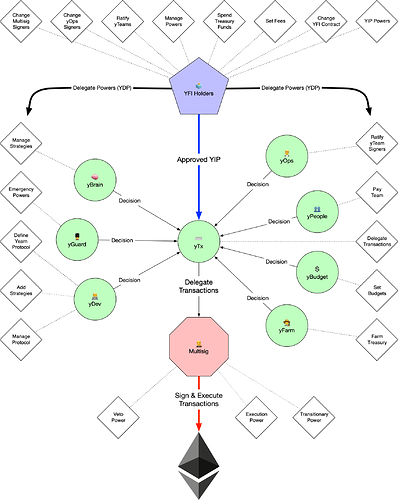

# YIP-61: Governance 2.0

| Metadata | Details |
| --- | --- |
| YIP | 61 |
| Outcome | **Passed** |
| Authors | tracheopteryx, lexnode |
| Created | 2021-04-20 |
| Forum discussion | [View discussion](https://gov.yearn.fi/t/yip-61-governance-2-0/10460#binding-snapshot-vote-28) |
| Snapshot vote | [View vote](https://snapshot.org/#/s:ybaby.eth/proposal/QmSMyYeKrRpnA7Xn56o2NtbCUzxmhzCupL7LxMA1reXxq4) |
| Vote result | Yes, I vote for this proposal: 683.09; No, I vote against this proposal: 0.2 |
| Source | [Source](https://github.com/yearn/YIPS/blob/master/YIPS/yip-61.md) |

## Authors

[@tracheopteryx](https://gov.yearn.fi/u/tracheopteryx), [@lex_node](https://gov.yearn.fi/u/lex_node)

## Summary

A proposal to establish the future of yearn's operational governance by extending certain of the Multisig's[[1]](https://gov.yearn.fi/t/yip-61-governance-2-0/10460#References) powers from YIP-41 (Temporarily Empower Multisig)[[2]](https://gov.yearn.fi/t/yip-61-governance-2-0/10460#References) on a newly clarified basis in coordination with newly empowered autonomous contributor teams ('yTeams').

## Status

This proposal passed on April 25, 2021 at 7:00 UTC with 99.97% voting for.\
See the vote on [Snapshot 80](https://snapshot.org/#/ybaby.eth/proposal/QmSMyYeKrRpnA7Xn56o2NtbCUzxmhzCupL7LxMA1reXxq4).\
Learn about our voting rules in YIP-55[[3]](https://gov.yearn.fi/t/yip-61-governance-2-0/10460#References).

## Abstract

if adopted, this proposal seeks to:

- ratify continued delegation by YFI holders to the Multisig of certain powers first approved in YIP-41 (Temporarily Empower Multisig), together with certain modifications and clarifications to the nature and scope of such powers as set forth below;
- delegate certain powers to a set of yearn contributor teams that have emerged organically from the community ('yTeams'), as appropriate for each yTeam based on its objective ('yGuard,' 'yBrain,' 'yDev,' 'yPeople,' 'yBudget,' 'yFarm,' 'yTx,' and 'yOps');
- update and clarify YFI holders' role in governance and the types of proposals available.

## Motivation

In August 2020, YIP-41 (Temporarily Empower Multisig) was approved by YFI holders to:

- temporarily empower yearn Multisig members "to make personnel & budgetary decisions" for a six-month period; and
- task the Multisig with "facilitating the creation and transition to a multi-DAO structure".

Since YIP-41 was approved, the Multisig has fostered a 'multi-DAO structure' by encouraging the development of autonomous 'yTeams' consisting of volunteer and paid specialist contributors.

The six-month Multisig empowerment period was extended for three-months via YIP-59[[4]](https://gov.yearn.fi/t/yip-61-governance-2-0/10460#References) on February 24th, 2021 and will expire on May 24th, 2021. Thus, before the expiration date, YFI holders should approve a new proposal to establish the future direction of yearn governance. This YIP constitutes such a proposal and, if approved, would supersede YIP-41 and ratify yearn's current *de facto* operational governance practices.

## Specification

### Governance 2.0 Overview

We present here the first phase of a progressive decentralization and improvement to yearn's governance. This proposal seeks to update the decision-making structures within yearn, not their software implementation. It is our intent to offer implementation proposals in the future once this model is validated and the appropriate technologies become available for use.

[

Yearn is a network of independent doers united by a shared vision. Our bias is on action over bureaucracy. We move fast with great freedom and agency. This is our way. Towards this end, we have pioneered a method of governance we call 'constrained delegation' whereby YFI holders delegate their governance powers to autonomous groups like the Multisig and yTeams and thus empower them to be creative. Gov 2.0 takes that a step farther by making governance powers discrete and transferable objects under the direct control of YFI holders.

### YFI Holders

Gov 2.0 connects YFI holders to yearn's products and teams through a more direct, aligned, and transparent mechanism --- giving them direct control over who gets to make decisions. Rather than being asked to make specific, operational decisions, YFI holders will conduct how power flows within yearn, wielding granular and clear control over every aspect of what yearn does.

YFI holders will now be empowered to take three kinds of actions:

| Proposal                         | Description                                                                                           | Hypothetical Examples                                                                                                                                                                     |
| -------------------------------- | ----------------------------------------------------------------------------------------------------- | ----------------------------------------------------------------------------------------------------------------------------------------------------------------------------------------- |
| Yearn Improvement Proposal (YIP) | A proposal to execute on any power delegated to YFI holders or outside the scope of enumerated powers | Ratify a new yTeam and assign it power; Burn the YFI minting keys; Do anything outside the scope of proscribed powers, like change yearn's name; remove a yOps signer; mint a new power   |
| Yearn Delegation Proposal (YDP)  | A proposal to change where any discrete decision-making power is delegated                            | Move the 'Pay Team' power from yPeople to a new yTeam; undelegate the 'Set Budgets' power from underperforming yBudget team and delegate to YFI holders until a new solution can be found |
| Yearn Signaling Proposal (YSP)   | A non-binding proposal to signal community feelings or intent on any issue                            | A suggestion to change membership in a yTeam; A desire for a new kind of vault or product                                                                                                 |

### yTeams

yTeams are small, autonomous groups of yearn contributors empowered by YFI holders to act independently in the best interest of yearn within a constrained domain of action and with enumerated, discrete decision-making powers.

Each yTeam will be organized around a group of signers. The signers for each yTeam should be nominated by rough social consensus of that yTeam and be reasonably acceptable to the Ops yTeam ('yOps'). yTeam signers are empowered to choose their own consensus mechanism for decision-making and curate their own discussion and feedback groups on telegram. Decisions issued by yTeams will be executed on-chain by the Multisig until a more decentralized system is approved for implementation.

It is important to note that yTeams are not the only teams that can work on the yearn ecosystem. Indeed, each of the current yTeams was formed permissionlessly, emerging on an ad hoc basis as enthusiasts grouped around a workstream. This proposal is merely recognizing that a number of such informal groups have achieved sufficient consistency of membership, quality of results and autonomy of internal governance to deserve a constrained delegation of powers from YFI holders. More informal contributors should continue working, alone or in groups, on yearn and seeking to have their contributions ratified by YFI holders on a more granular, post hoc basis; these informal groups may also eventually coalesce into additional yTeams.

See below under "Constrained Delegation" for additional thinking on the governance philosophy underlying yTeams.

| yTeam   | Objective               | Membership Pool                                                                                                                                                                                                                               |
| ------- | ----------------------- | --------------------------------------------------------------------------------------------------------------------------------------------------------------------------------------------------------------------------------------------- |
| yGuard  | Protect the vaults      | YFI Protocol Dev, YFI Strategists, YFI Mechanics, YFI Secret Admirers                                                                                                                                                                         |
| yBrain  | Manage the strats       | YFI Strategists                                                                                                                                                                                                                               |
| yDev    | Manage the protocol     | YFI Protocol Dev                                                                                                                                                                                                                              |
| yPeople | Curate the team         | YFI Compensation Working Group, YFI Advisors                                                                                                                                                                                                  |
| yBudget | Spend money well        | YFI Finances, YFI Advisors                                                                                                                                                                                                                    |
| yFarm   | Grow the treasury       | YFI Secret Admirers, YFI Secret Entrance                                                                                                                                                                                                      |
| yTx     | Write transactions      | YFI Doers                                                                                                                                                                                                                                     |
| yOps    | Coordinate contributors | YFI Ops (initial signers: [@banteg](https://gov.yearn.fi/u/banteg), [@lehnberg](https://gov.yearn.fi/u/lehnberg), [@milkyklim](https://gov.yearn.fi/u/milkyklim), [@tracheopteryx](https://gov.yearn.fi/u/tracheopteryx)) |

### The Multisig

In effect, the Multisig is a special yTeam ('yChad') utilizing a Gnosis Safe multisig[[5]](https://gov.yearn.fi/t/yip-61-governance-2-0/10460#References) for on-chain execution. While most of the decision-making powers previously held by the Multisig move to yTeams, the execution power stays with the Multisig pending future proposals. The Multisig is tasked with executing the decisions issued by yTeams within their domains of action and with 'Veto Power' should they feel a decision needs further review. As we iterate on governance in the future, YFI holders can decide to delegate this 'Veto Power' to external arbitration or other forms of secure adjudication.

## Decision-Making Powers

| Power                     | Delegation  | Description                                                                                                                                           |
| ------------------------- | ----------- | ----------------------------------------------------------------------------------------------------------------------------------------------------- |
| Manage Powers             | YFI Holders | YFI holders can vote to create, assign, or revoke discrete powers to or from yTeams.                                                                  |
| Change YFI Token Contract | YFI Holders | Any interaction with the YFI token contract, such as to mint YFI or burn the minting keys, remains under the control of YFI holders.                  |
| Set Fees                  | YFI Holders | Set the standard fee structures in the Yearn Protocol                                                                                                 |
| Change Multisig Signers   | YFI Holders | As the Multisig will continue to hold critical powers over the near term, only YFI holders can vote to change its signers                             |
| Ratify yTeams             | YFI Holders | Formally ratify or deratify yTeams to control which yTeams can hold delegated powers                                                                  |
| Change yOps Signers       | YFI Holders | As yOps has the power to change signers of other yTeams, this is a special power to change the signers of yOps                                        |
| Spend Treasury Funds      | YFI Holders | Spend funds from the treasury                                                                                                                         |
| YIP Power                 | YFI Holders | YFI Holders have the power to propose a YIP on anything not already delegated                                                                         |
| Execution Power           | Multisig    | The power to execute decisions made by YFI holders and yTeams on-chain                                                                                |
| Veto Power                | Multisig    | This power allows the Multisig to veto any decision and ideally should not be needed                                                                  |
| Transitionary Power       | Multisig    | A temporary power enabling the Multisig to operate under the mandate of YIP-41 until the set of decision-making powers covers all needed transactions |
| Emergency Powers          | yGuard      | Immediately intervene in case of attack or bug to shutdown or rollback strategies or vaults                                                           |
| Manage Strategies         | yBrain      | Activate, deactivate, tune, and maintain strategies                                                                                                   |
| Define Yearn Protocol     | yDev        | Decide what code is considered part of yearn and what isn't                                                                                           |
| Manage Protocol           | yDev        | Maintain and improve the Yearn Protocol                                                                                                               |
| Add Strategies            | yDev        | Add new strategies to vaults                                                                                                                          |
| Delegate Transactions     | yTx         | Create delegated transactions for the multisig to sign and execute                                                                                    |
| Pay Team                  | yPeople     | Create, deploy, modify, or terminate Yearn compensation packages                                                                                      |
| Set Budgets               | yBudget     | Create budgets for coordinape, grants, hiring, operations, or other workstreams                                                                       |
| Farm Treasury             | yFarm       | Farm with the treasury and make decisions on airdrops                                                                                                 |
| Ratify yTeam Signers      | yOps        | Formally approve or remove signers for each yTeam                                                                                                     |

## Implementation

This proposal requires no additional implementation beyond the adoption of new processes utilizing the platforms currently active within yearn.

The nested consensus mechanisms needed for yTeams can be implemented in a number of ways today, but after much discussion and feedback from the core team and yearn community the authors decided to limit this proposal to the social layer. The detailed description of yearn governance provided in the proposal is intended to guide the research and development of new governance platforms custom tailored to yearn's specific needs to be developed and proposed for our use in the near future.

Our friends at Gnosis[[5]](https://gov.yearn.fi/t/yip-61-governance-2-0/10460#References), Colony[[6]](https://gov.yearn.fi/t/yip-61-governance-2-0/10460#References), LEGO Dao[[7]](https://gov.yearn.fi/t/yip-61-governance-2-0/10460#References), Snapshot[[8]](https://gov.yearn.fi/t/yip-61-governance-2-0/10460#References), Tally[[9]](https://gov.yearn.fi/t/yip-61-governance-2-0/10460#References), finance.vote[[10]](https://gov.yearn.fi/t/yip-61-governance-2-0/10460#References), and Orca Protocol[[11]](https://gov.yearn.fi/t/yip-61-governance-2-0/10460#References) have offered to help us build whatever we need to implement our vision of governance.

## Examples

To help clarify how the changes proposed in this specification will function in the wild, here are some hypothetical examples of decision-making in Governance 2.0.

### Replacing a yOps Signer

Banteg goes rogue, starts shilling XRP hard and is absent from important Yearn work. Someone creates a YIP to replace him from yOps with Justin Sun (who has become a benevolent, humble, and trusted yearn contributor). The vote passes, banteg is removed as a signer and Justin is added.

### Creating a new yTeam

It turns out pension funds are yearn's golden opportunity. A group of contributors on the dev team have been working on a whole new product line. Someone creates a YIP to ratify this group as a yTeam ('yPension') and assign them management power over the new set of contracts for the pension product. The vote fails to pass, the new pension contracts remain under the control of yDev where they were made, and the pension group can still work but without specific power.

### Deciding on an Airdrop

Spurn Finance, an unauthorized fork of yearn on Iota launches and sends a large airdrop of SPYFI direct to the Multisig. They say in their docs it's supposed to "reward the yearn community." The yFarm team has the 'Farm Treasury' power which includes deciding on what to do with airdrops. They decide to give 50% of the tokens to Andre and the rest to a Coordinape[[12]](https://gov.yearn.fi/t/yip-61-governance-2-0/10460#References) contributor circle for distribution.

This causes conflict in the community. Some members feel the airdrop should have been given to all YFI holders proportional to their holdings. Other think they should have been given to vault users proportional to TVL. Others think all should have gone to the community contributors not just half.

yFarm decides to stick to their belief and they send their decision to yTx. yTx creates a transaction to implement yFarm's decision and delegates it to the Multisig. During this time there is much discussion on twitter, telegram, discord, and the forum. People ask the Multisig to veto it to give them time. Since there is so much turmoil, the Multisig does decide to veto and give the community more time to think about other options. yFarm is fine with that, they can always resubmit again later.

Someone makes a YDP to remove the 'Farm Treasury' power from yFarm but it fails since they were being super reasonable. A number of alternate allocations are suggested. Andre comes out and says thank you, but he doesn't want the airdrop. Someone puts forth a new split that goes to YFI holders, vault users, and a Coordinape circle that they agree to implement. yFarm likes it, but changes the proportions a bit, then they puts through the tx which the Multisig does not veto and it is executed.

### Redelegating Veto Power

Kitten Court (an unauthorized fork of Kleros Court on Dogecoin) comes out with a new product, the Veto Master 9000, it's an AGI that can decide on vetoes better than humans. Someone makes a YDP to move 'Veto Power' from the Multisig to the Veto Master 9000. It fails because this is obviously a skem.

### Yearn Proposals & Delegated Powers

Vitalik joins the dev team and people are so pumped they want him on yDev immediately. Someone writes a proposal to add Vitalik as a yDev signer and wants it to be a YIP. But YFI holders don't have that power, so the proposal can only be a YSP (Yearn Signaling Proposal). yOps has the 'Ratify yTeam Members' power, so it's up to them to decide. The YSP ends with 95% of voters signaling yes. yOps thinks this is meaningful, so they agree that if Vitalik wants the job, they will ratify him as a signer. He agrees. We all party in a space hotel.

### Adding a Product to the Yearn Protocol

Andre writes a new perpetual insurance product. This can be part of vaults and a stand-alone product. It's passed audits and looks great. Another community contributor, VALISfan1981, has also written a perpetual insurance product and she has deployed it already, unaudited on her own site which allows people to deposit into vaults with her insurance system. She wants yearn to adopt her product as part of the Yearn protocol.

yDev has the 'Define Yearn Protocol' power. They review both options, discuss with the community, and decide to add Andre's code as part of yearn and use dev team resources to develop it further. VALISfan1981 can continue to offer their alternative product, of course, but it will be offered as an outside service.

### Deciding Something Outside of Defined Powers

Dark Ghosty decides that the Spix's Macaw[[13]](https://gov.yearn.fi/t/yip-61-governance-2-0/10460#References) is the official bird of yearn and is telling everyone this on telegram. He's really pushing hard for it. Deciding on our official bird is not a defined power. Anyone can say that a bird is yearn's official bird, but that doesn't mean anything. But Ghosty loves that bird, so he does a proposal to adopt the Spix's Macaw as the official bird of yearn. The forum poll looks good, so he goes ahead and does a YIP, and that passes. The Spix's Macaw becomes the official bird of yearn.

### Aggressive Attempt to Fund a New Project

The Coordinape team wants to ask yearn for a grant to fund development. They can ask yOps since they have a set amount of money for stuff like this that they get from the treasury as determined by yBudget via their 'Set Budgets' power. yOps says no, so Coordinape decides to ask yBudget directly to allocate them some recurring funds, but they say no too. Then they go to yDev and ask to be added to the Yearn Protocol with the 'Define Yearn Protocol' power so the dev team will help them build their product, but they are too busy.

Next option, they do a proposal to ask YFI holders to fund them. They get to the YIP but it fails. The Coordinape team is pissed. They work their asses off and have an amazing product. So they craft a devious plan...

First they do a new proposal to ratify themselves as the yApe yTeam. The YIP passes! yOps talks to the new yApe team and together they decide who the signers should be, and yOps formalizes them with their 'Ratify yTeam Members' power.

yApe is a yTeam but they have no power. They do a YDP to take the 'Set Budget' power from yBudget and spend thousands of dollars on a marketing campaign to convince YFI holders. But YFI holders don't buy it, they can tell something is off, and the YDP fails. yApe does a new YIP to create a new power 'Fund Coordinape' and this fails too. The community is not happy with Coordinape, so someone does a YIP to deratify their yTeam, it passes.

After some soul searching, the team recognizes their mistake, makes an apology, and yOps decides to give them a grant. It's enough to make a sick product which changes the world.

## Rationale

### Constrained Delegation

The authors of this YIP embrace the principles of creative freedom for yearn contributors set forth in what has come to be known as "the yearn manifesto"[[14]](https://gov.yearn.fi/t/yip-61-governance-2-0/10460#References). Anyone with the requisite talent, ideas and willingness to work should be able to contribute to yearn, even if they do not hold YFI, and even if YFI holders do not authorize them to do so. Thus, we see the merits of what may be called a 'core development' philosophy of technology governance, and do not believe that yTeam members should need to be elected by or otherwise formally *accountable* to YFI holders. On the other hand, we also recognize the 'tyranny of structurelessness' that can ensue when anarchist principles of self-organization are pushed to the extreme, as well as the omnipresent threat that core-style governance can become captured through its dependence on the patronage of for-profit corporations and their proxies ('associations,' 'foundations,' 'consortiums,' etc.)

Similarly, we recognize both the potential benefits and perils of bottom-up, DAO-style governance. YFI was disseminated as 'the governance token of yearn'. Although the meaning, scope and mechanisms of such governance were (perhaps deliberately) under-specified at the time of YFI's creation, certain emergent cultural values are fairly clear: YFI holders expect that they have a vital value-creation role in the yearn community even if they do not have technical skills and are not 'core developers' or other highly active creative participants in yearn. Furthermore, YFI holders expect that yearn contributors do not work *contrary* to YFI holders' interests. For example, it would be unacceptable for the Multisig to drain the entire treasury to give themselves unearned or excessive bonuses. But, just as creative autonomy can degenerate into the tyranny of structurelessness, so, too, DAO governance can deteriorate into "the tyranny of the masses"---bikeshedding, needless bureaucracy and populist political haggling are all apt to emerge when decision-making is driven by those who view crowdsourced governance as an end-in-itself.

We can see the tension between creative freedom and group consensus play out at the practical level in a kind of Catch-22 faced by creators. If all decision-making authority is vested in governance token holders, then, in theory, all uses of community resources should be pre-approved by token holder voting. So, for example, if a developer needs a budget to create a new product, the developer would first need to write up a spec & get it and the budget approved by YFI holders. However, this is far from ideal, because developing such a spec itself requires effort and resources, and the approved spec may unnecessarily constrain freedom, requiring the developer to go back to governance to get re-approval for deviations from the spec that are inspired during the development process. On the other hand, a developer could self-fund the product and submit it for ratification of YFI holders and a financial reward after it is done, but this is also suboptimal: it essentially creates a negative externality on developers by requiring them to bootstrap a project that might not end up with product/market fit or an adequate reward, thus deterring new contributions.

Because of the way the Multisig was empowered in YIP 41, the yearn community has generally skirted this governance Catch-22. Most new development has been funded at the discretion of the Multisig and, after funding but before full deployment, has been ratified to become an official part of yearn through a proposal to YFI holders. We believe this is an important part of why the yearn community is known for having some of the most capable volunteer developers with the most aggressive pace of innovation of any DeFi community. If political debates were a gating item to every new project, good devs would be deterred or hampered from contributing to yearn, yearn's progress would be slow.

We note, however, that while this process has been effective, it has led to a muddled conception of governance that spawns many questions, e.g.: 'How meaningful can governance be if YFI holders are only asked to sign off on a new development after there are material sunk costs?' 'What does it mean for a new product to be 'accepted into yearn,' and who gets to decide that?' 'What do YFI holders govern?'

Our modest proposal for threading the needle through these philosophical tapestries is a model we call 'constrained delegation'--in effect, YFI holders delegate their governance powers to autonomous groups like the Multisig and yTeams and thus empower them to be creative. These battle-tested, YFI-approved yTeams are privileged to be able to get funding on a more spontaneous, informal basis and have their contributions presumed to be 'yearn-official', but are still subject to being monitored by YFI holders and disenfranchised if they abuse their roles.

In contrast to core governance (which is top-down relative to users and bottom-up relative to creators) and DAO governance (which is top-down relative to creators and bottom-up relative to users), 'constrained delegation' avoids subordinating either group to the other. Instead, we propose using a kind of checks-and-balances system that has more in common with the governance of corporations than that of *kibbutzes*, while still being more open, creative and spontaneous. Unlike with a corporation, yearn has no state charters, legal agreements or fiduciary relationships. YFI holders have not made an investment of capital into yearn, do not hold 'shares' with rights defined by a state statute, and should not expect that yTeam members will act like single-minded automatons blindly devoted to increasing YFI holders' profits at the expense of more multifarious purposes. Rather, if yearn is similar to a corporation, it is more like an idealistic version of a public benefit corporation---a public commons that exists to simultaneously benefit many different kinds of stakeholders (users, creators, students, other friendly DeFi communities, etc.) in a delicate set of tradeoffs.

Through rough consensus, YFI holders govern *de facto* rather than *de jure* and use that socially constructed governance influence to actively monitor and, to the extent desired, modulate the behavior of contributors. When it comes to governing yTeams, this governance may often look very similar to YFI holders 'doing nothing,' because YFI holders have already endorsed the Multisig and yTeams and they are presumed to act on a selfish but incentive-aligned basis consistent with the expectations of the community. However, when the contributors stray too far, or fail to communicate adequately, YFI holders should always be waiting in the wings to intervene in the situation, revoke their endorsement and restore a positive-sum equilibrium for the yearn community.

### The Future

This proposal architects a powerful, flexible, and novel form of decentralized governance that satisfies two critical needs: 1) giving YFI holders clear control and 2) empowering the team to execute with the speed yearn is famous for.

We believe that DAOs are in their infancy and there is much to learn. Although the promise of fully on-chain and trustless governance is alluring, we are not there yet. Behind every DAO implementation, there is a group of trusted contributors. Our model seeks to foreground these trusted relationships and give YFI holders the ability to modify them directly.

This proposal provides a northstar for implementations of Gov 2.0 that can iterate and improve over time. Here are some additional ideas we would like to explore further in the future:

- implement nested multisig-style consensus mechanisms such that each yTeam has execution power for their domain of action, flexibly reconfigurable based on delegated powers
- move away from proxy voting via either a tool like SafeSnap[[15]](https://gov.yearn.fi/t/yip-61-governance-2-0/10460#References) or an on-chain L2 implementation with something like Compound's Governor Bravo[[16]](https://gov.yearn.fi/t/yip-61-governance-2-0/10460#References)
- tokenize decision-making powers as NFTs for improved transparency and functionality
- deprecate veto power via third-party arbitration
- utilize Coordinape for some yTeams, for example:
  - budget allocation circle (yBudget)
  - compensation setting circle (yPeople)
- explore using conviction voting to establish new yTeams and their membership
- migrate to on-chain voting using Colony v2, utilizing reputation for yTeams
- collaborations with Gnosis, Colony, LEGO Dao, Tally, finance.vote, and Orca Protocol
- establish practices for ratification of yTeams wielding off-chain decision-making powers on domains such as marketing, docs, and the web

## Credit

This proposal is the result of months of work across many teams and has benefited from the advice and feedback of dozens of brilliant people. You know who you are. Thank you. And a special shout out to the YFI Governance telegram group in particular for the regular and lively discussions.

_Source: [Snapshot](https://snapshot.org/#/ybaby.eth/proposal/QmSMyYeKrRpnA7Xn56o2NtbCUzxmhzCupL7LxMA1reXxq4)_

## References

[1] [FAQ - yearn.finance 10](https://docs.yearn.finance/faq#what-is-the-multisig-and-what-do-they-do)\
[2] [https://gov.yearn.fi/t/yip-41-temporarily-empower-multisig](https://gov.yearn.fi/t/yip-41-temporarily-empower-multisig)\
[3] [YIP-55: Formalize the YIP Process 8](https://gov.yearn.fi/t/yip-55-formalize-the-yip-process/7959)\
[4] [https://gov.yearn.fi/t/yip-59-temporarily-extend-multisig-empowerment](https://gov.yearn.fi/t/yip-59-temporarily-extend-multisig-empowerment)\
[5] [https://gnosis-safe.io/ 7](https://gnosis-safe.io/)\
[6] [https://colony.io/ 4](https://colony.io/)\
[7] [https://twitter.com/lego_dao 6](https://twitter.com/lego_dao)\
[8] [https://snapshot.org/](https://snapshot.org/)\
[9] [https://www.withtally.com/ 1](https://www.withtally.com/)\
[10] [https://www.finance.vote/ 2](https://www.finance.vote/)\
[11] [https://www.orcaprotocol.org/ 9](https://www.orcaprotocol.org/)\
[12] [http://coordinape.com/ 8](http://coordinape.com/)\
[13] [Spix's macaw - Wikipedia 10](https://en.wikipedia.org/wiki/Spix's_macaw)\
[14] [https://gov.yearn.fi/t/how-we-think-about-yearn](https://gov.yearn.fi/t/how-we-think-about-yearn)\
[15] [https://blog.gnosis.pm/introducing-safesnap-the-first-in-a-decentralized-governance-tool-suite-for-the-gnosis-safe-ea67eb95c34f 2](https://blog.gnosis.pm/introducing-safesnap-the-first-in-a-decentralized-governance-tool-suite-for-the-gnosis-safe-ea67eb95c34f)\
[16] [Compound | Docs - Governance 3](https://compound.finance/docs/governance)
