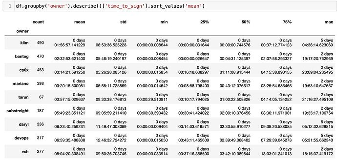

# YIP-62: Change Two Multisig Signers

| Metadata | Details |
| --- | --- |
| YIP | 62 |
| Outcome | **Passed** |
| Authors | banteg, lehnberg, milkyklim, tracheopteryx |
| Created | 2021-05-24 |
| Forum discussion | [View discussion](https://gov.yearn.fi/t/yip-62-change-two-multisig-signers/10758) |
| Snapshot vote | [View vote](https://snapshot.org/#/s:ybaby.eth/proposal/QmddCbGYbkooZ1zp8oYnbBz6frXLRc9xbkapXcuZcdzmMF) |
| Vote result | yes, I vote for this proposal: 415.75; no, I vote against this proposal: 1.51 |
| Source | [Source](https://github.com/yearn/YIPS/blob/master/YIPS/yip-62.md) |

## Authors

[@banteg](https://gov.yearn.fi/u/banteg), [@lehnberg](https://gov.yearn.fi/u/lehnberg), [@milkyklim](https://gov.yearn.fi/u/milkyklim), [@tracheopteryx](https://gov.yearn.fi/u/tracheopteryx)

## Summary

A proposal to exercise the 'Change Multisig Signers' power held by YFI holders as defined by Governance 2.0[[1]](https://gov.yearn.fi/t/yip-62-change-two-multisig-signers/10758#References) in order to change two signers who have served yearn well and rotate in fresh blood to improve signing speed.

## Status

This proposal is currently in the voting phase. Cast your vote on [Snapshot 32](https://snapshot.org/#/ybaby.eth/proposal/QmddCbGYbkooZ1zp8oYnbBz6frXLRc9xbkapXcuZcdzmMF).

You can learn about our voting rules in YIP-55[[2]](https://gov.yearn.fi/t/yip-62-change-two-multisig-signers/10758#References).

## Abstract

If adopted, this proposal will:

- remove [@Substreight](https://gov.yearn.fi/u/substreight)[[3]](https://gov.yearn.fi/t/yip-62-change-two-multisig-signers/10758#References) and [@tchitra](https://gov.yearn.fi/u/tchitra)[[4]](https://gov.yearn.fi/t/yip-62-change-two-multisig-signers/10758#References) as multisig signers
- add [@RyanWatkins](https://gov.yearn.fi/u/ryanwatkins)[[5]](https://gov.yearn.fi/t/yip-62-change-two-multisig-signers/10758#References) and [@Lumberg](https://gov.yearn.fi/u/lumberg)[[6]](https://gov.yearn.fi/t/yip-62-change-two-multisig-signers/10758#References) as mulitsig signers

## Motivation

Serving on the yearn multisig is hard work, we should rotate signers regularly and ensure that all signers are reasonably active and available to keep signing speed and engagement high. Both Substreight and Tarun have agreed to step out and Leo and Ryan have agreed to step in.

Big thanks to everyone on the multisig, this adjustment should not be seen as a critique in any way. We are all busy and appreciate all the work this group does.

_Analysis of multisig signer activity as of 26 April 2021_

## Specification

To execute the transition we don't need to change the threshold, just execute 2 sequential multisig transactions:

1.  Replace 0x6626593c237f530d15ae9980a95ef938ac15c35c (Tarun) with 0x757280Bd46fC5B1C8b85628E800c443525Afc09b (Ryan)
2.  Replace 0x50B0C406a5C1fC492F84c3F3D4552391cF4672f2 (Substreight) with 0x7321ED86B0Eb914b789D6A4CcBDd3bB10f367153 (Leo)
