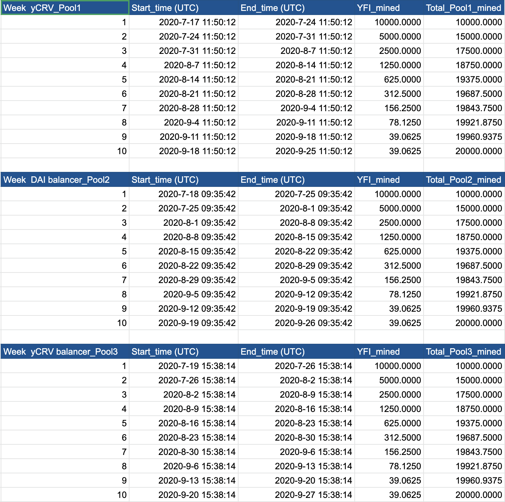

# YIP-8: Halving YFI weekly supply the same as bitcoin

| Metadata | Details |
| --- | --- |
| YIP | 8 |
| Outcome | **Rejected** |
| Authors | steamer.eth |
| Created | 2020-07-22 |
| Forum discussion | [View discussion](https://gov.yearn.fi/t/proposal-8-halving-yfi-weekly-supply-the-same-as-bitcoin/263/) |
| Snapshot vote | Not recovered |
| Vote result | No Snapshot vote recovered. |
| Source | [Source](https://github.com/yearn/YIPS/blob/master/YIPS/yip-8.md) |

## Simple Summary

Currently the weekly supply increase of YFI is 30,000 per week. Vote under proposal #0 is if more YFI tokens should be minted.

I’m voting “FOR” on proposal #0 16 as continuous incentivization of LPs is important for growth of the platform. Most of reasons are the same with proposal 5.

**More Reasons:**

1. The YFI mining will be end in 3 days, while the whole crypto community needs more time to understand this complex mechanism. In such a short period of time, YFI cannot generate an effective market pricing.
2. To stop the YFI mining will instantly result to a huge amount remove of the liquidity, this will be a huge negative to the YFI price because of the decreasing of fee rewards.

This is a proposal for reducing the weekly issuance rate with a model the same as BTC. Two months is enough to educate the crypto community while finishing the YFI generate event.

**The pros of the bitcoin halving model:**

1. Halving every week is quite easy to be understood in the crypto community, and effective.
2. Easy to make memes of YFI - “ YFI is the Bitcoin in Defi ” for virus spreading.
3. Enough time for the markets to reach the equilibrium. (liquidity provider’s YFI revenue is halved every week while taking the same risks, will result in a steady change in liquidity)

[Modeling of 3 Pools](https://docs.google.com/spreadsheets/d/1ORG5UJUc2kKyjkemeskbpfpAfbDZ9Wk7GSEUc4RG2O0/edit?usp=sharing)

In summary. If proposal #0 passes the issuance model should be altered as described above.

**FOR**: Support the new issuance model.

**AGAINST**: Do not support the new issuance model.

## Metadata

| Name                | Value                                      |
| ------------------- | ------------------------------------------ |
| Proposed by         | 0xe2ca7390e76c5A992749bB622087310d2e63ca29 |
| Total for votes     | 3527868.1621 (80.25%)                      |
| Total against votes | 867838.6309 (19.74%)                       |
| Quorum              | 9.73% 𐄂                                    |
| Start block         | 10508388                                   |
| End block           | 10525668                                   |

Source: [yieldfarming.info YFI Governance Information](https://yieldfarming.info/yearn/vote/)
