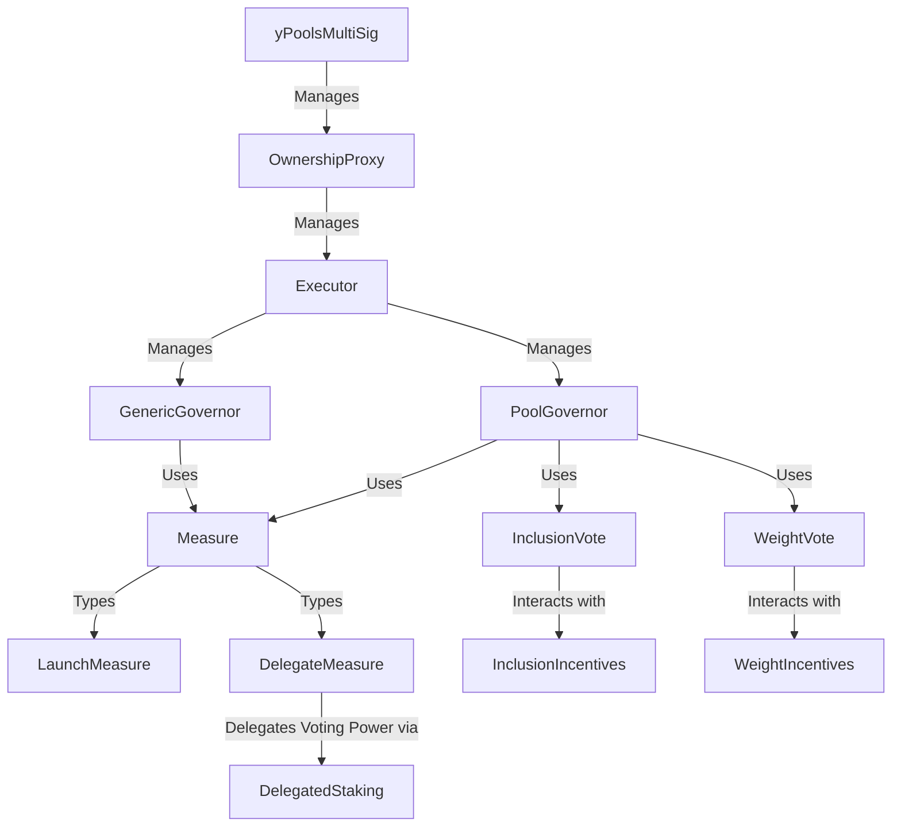

# Governance Specification

Contracts for fully on-chain governance, consisting of multiple cooperating components. Each component can be swapped out in the future if our requirements change. The different concepts and contracts are as follows:

- The entire protocol defines a set of management roles, which have powers within the protocol to set variables, rates, add assets etc. With the transition to on-chain governance, the **OwnershipProxy** will become the new owner of all these management roles, including the ones descriped below (excluding the proxy's own). This contract is very simple and is able to execute arbitary contract calls. Note that this is not a delegatecall proxy!
- The proxy has its own management, which will be the **Executor** and has permission to execute calls through the proxy. The executor maintains a list of governors, which are allowed to execute function calls through executor onto the proxy. In addition, the executor has the ability to enable a whitelist or blacklist for combination of address+selector. This allows us to define governors with only limited power.
The executor is self-governing, meaning the proxy is supposed to fulfill its management role.
The two-layer design of proxy and executor allows us to easily replace the executor if desired without having to move all the management permissions over one by one.
- There are two governors: **GenericGovernor** and **PoolGovernor**. They both take governance actions based on on-chain voting procedures.
- On-chain voting is based on 4 week long _epochs_. These coincide with Curve epochs, starting on a Thursday 00:00 GMT.
All voting takes place on the last week of the epoch.
- The voting power of governance participant is measured by a **Measure**. At launch, we used the **LaunchMeasure** on Snapshot (with **SnapshotToken**, which simply provides an ERC20 for the launch measure). The launch measure simply defines the vote weight as the user's st-yETH weight plus the user's share of the bootstrap st-yETH weight.
- With the transition to on-chain governance, a new measure is introduced, the **DelegateMeasure**. By default this returns the same value as the launch measure. But management has the ability to delegate the voting power of an account that deposited into a **DelegatedStaking** contract to another account. This gives some of the st-yETH balance as voting power to the delegator.
- In the first 3 weeks of the epoch, the **GenericGovernor** accepts proposals from anyone with sufficient voting weight. Proposals come in the form of a script, which will be executed on the executor if passed. In the final week of the epoch, users vote in favor or against each proposal. At the end of the epoch, all proposals that pass a threshold of relative votes in favor, will have passed. They become executable by anyone after a delay.
The author of the proposal can retract their proposal, and management can cancel any before it is executed.
- A second voting contract is **InclusionVote**. In the first three weeks, anyone can apply (upon paying a fee) for a token to be whitelisted for the vote.
A special role, the operator, has the task of setting rate providers for each of the applicants. An application with a rate provider automatically becomes whitelisted, meaning they can be voted on.
The voting takes place in the last week of the epoch. The asset with the largest number of votes will be added to the pool.
One of the vote options is a 'blank' vote. If that option has the most votes, no new asset will be added to the pool this epoch.
- Anyone can post incentives for any asset to be added to the pool in **InclusionIncentives**. If the asset wins the vote and is added, the incentives are paid out to everyone that voted. If the asset does not win, the incentives are refunded.
- The third voting contract is **WeightVote**. This contract is used to vote on the existing assets in the pool, and a 'blank' option. At the end of the epoch, a certain percentage of all weight is redistributed according to the result of this vote.
- The **WeightIncentives** contract is used to post incentives for voting on the assets. The incentives are distributed according to the voting weight dedicated by each user to that specific asset.
- The inclusion voting and weight voting contracts are not governors, instead they are used by the **PoolGovernor**. After the end of the epoch, the pool governor first adds the winning asset (if any) to the pool with a very low weight, through the executor. Immediately after, it starts a weight ramp, redistributing weights according to the vote results, as well as increasing the weight of the new asset.
The pool governor is operated by an operator, which is a role tasked with adding the asset to the pool while minimizing the arb opportunities. This is a trusted role, but has very limited powers as it cannot change weights at will or add arbitrary assets.
