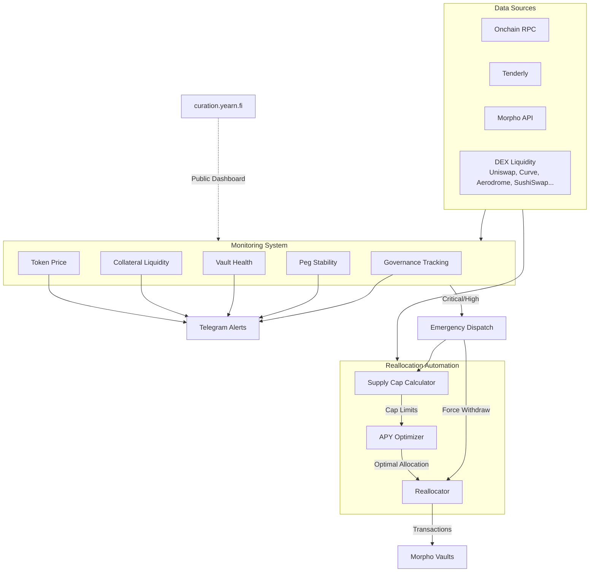
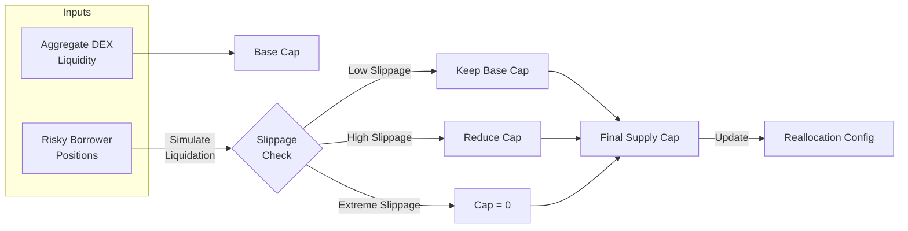
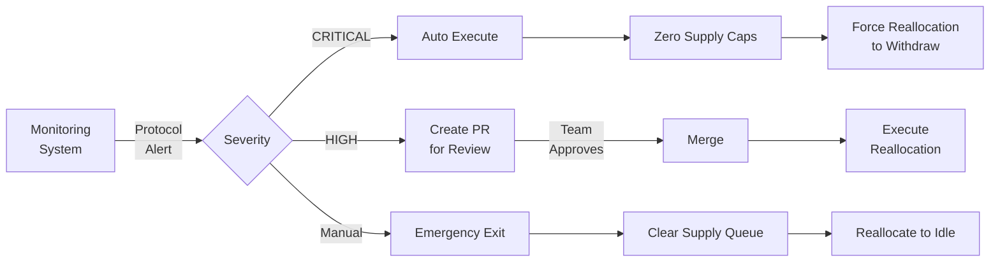

# Yearn Curation

## Our Origin Story

Yearn Curation started from an internal need to handle risk scores for Yearn strategies that deposit into Morpho Vaults. Each vault has its own curator and each curator has different risk appetites. Morpho Vault code is immutable, but the vault's composition changes. Curators can add and remove markets from vaults, and allocations to markets can change so that the vaults no longer match their previous risk scores. So we need to be able to react and update risk scores dynamically. To handle this flow, we build a monitoring stack for the Morpho Vaults used by Yearn V3 strategies. This risk monitoring captures events and triggers alerts when these vaults are not behaving as expected. You can read about how our monitoring works in the [monitoring section](#monitoring) of this page, and on our [GitHub repository](https://github.com/yearn/monitoring/tree/main/morpho).

With the monitoring stack already built, and the prerequisite knowledge about risk management already in-house, it made sense to take the next step and start curating on Morpho ourselves to make sure our strategies are always in line with our risk appetites.

We publish our risk assessments, token exposures, and Morpho market monitoring publicly on our [Yearn Curation Dashboard](https://curation.yearn.fi/). Transparency is a core principle — anyone can review the same risk data we use to make curation decisions.

## Vault Tiers

We sort our vaults into three risk tiers:

- **Yearn**: These vaults stick mostly to the big, well-known crypto markets (“blue-chips”). The goal here is steady, reliable yield with the lowest possible chance of things going sideways.
- **Yearn OG**: These vaults dip into markets that offer potentially higher yields but come with a bit more risk. They correspond to Yearn’s internal “risk level 2”, with some small allocations to "risk level 3" markets to boost yield with enhanced monitoring.
- **Yearn Degen**: These vaults are for those comfortable with higher risk for potentially even higher yields. They correspond to Yearn’s internal “risk level 3” and above.

## Curation Overview

## How We Decide Where to Deploy Funds

This is the most important thing we do. Choosing which markets to support and how much to send to each directly impacts the vault’s risk and its APY.

We don’t just guess! We use onchain data and simulations to calculate how these markets perform. The simulations look at market liquidity, asset liquidity, defined caps, and more. Based on this, we can take a few actions:

- **Adding New Markets**: When we find a good, safe market that fits the vault’s risk level, we can add it in. Each market is assigned a risk tier (1–5, where 1 is safest) based on oracle quality and asset liquidity. The vault’s overall risk level determines which tiers are allowed and how much allocation each tier can receive. Before adding a market, we produce a detailed risk assessment report covering audits, centralization risk, funds management, liquidity risk, and operational risk — each scored and weighted to produce a final risk score. All reports are published on our [curation dashboard](https://curation.yearn.fi/).
- **Tweaking Allocations**: Markets change! We run automated optimization hourly that uses constrained mathematical optimization to find the best allocation across all markets. The optimizer maximizes risk-adjusted yield while respecting supply caps, utilization ceilings, risk tier limits, and per-market allocation bounds. A reallocation only executes if the projected APY improvement exceeds a minimum threshold to justify gas costs. No single market can receive more than 95% of the vault’s total assets to allow exit liquidity for users if single market gets stuck with 100% utilization.
- **Setting Supply Caps**: We limit how much of the vault’s total funds can go into any single market. These caps are calculated multiple times a day using real-time on-chain data. The process aggregates liquidity across DEXs (Uniswap V2/V3/V4, Curve, Balancer, Aerodrome, SushiSwap, and more), analyzes borrower positions near liquidation thresholds, and simulates the slippage impact of liquidating risky collateral. If slippage exceeds acceptable levels, caps are automatically tightened — and if slippage is extreme, the cap drops to zero. We don’t immediately lower the supply cap onchain in Morpho contracts, but we lower it in our internal reallocation configuration. This allows us to keep the vault’s allocation below calculated caps and set higher caps if the market recovers without waiting for the timelock delay. If the caps remain elevated over a long period, we will lower the cap in the Morpho contracts to ensure maximum safety.

### Supply Cap Calculation

## Keeping Things Running Smoothly

Once a vault is set up, the job isn’t done. Market conditions, borrowing demand, and risks can change fast, so we’re always monitoring and ready to make adjustments.

- **Playing it Safe**: We constantly check onchain liquidity on DEXs for potential liquidation capacity and monitor borrower health on the Morpho market. We evaluate the collateral of risky positions and compare it with available onchain DEX liquidity to adjust the cap accordingly. We also aim to avoid overly utilized markets to ensure there’s always some breathing room for withdrawals.
- **Yield Optimization**: We analyze which markets are offering the best returns for their risk level and shift funds accordingly. Our goal is always the best risk-adjusted yield, not just the highest yield. And we use our models to predict how yield might change based on time market allocation.
- **Emergency Response**: When a protocol we lend into shows signs of distress, our monitoring system can automatically trigger emergency actions. For critical alerts (e.g., a collateral protocol’s reserves dropping dangerously low), the system can zero the supply caps for affected markets and force an immediate reallocation to withdraw funds — all without manual intervention. For high-severity alerts, that require maunally checks, a pull request is created for the team to review before executing. Individual vaults can also be shut down manually if needed, clearing their supply queue and reallocating to idle.

### Emergency Response Flow

Our strategy boils down to deeply understanding and managing risk. We use:

- Frequent Data Checks: On-chain liquidity, slippage simulations, risky borrower positions, and utilization rates.
- Automated Optimization: Reallocation runs using constrained mathematical optimization to find the best allocations, plus daily supply cap recalculation.
- Sensible Guardrails: A 72-hour time-lock for major changes gives everyone time to react if needed, and specific roles (Guardian, Reallocator, Owner) ensure actions are taken by the right parties with the right permissions. Safety constraints include a maximum 95% allocation per market, utilization ceilings, gas price limits.
- Monitoring: We monitor multiple DeFi protocols across multiple chains. From governance decisions to contract upgrades, on-chain liquidity to borrower health on the lending market, and other key risk factors.

By combining automated optimization with careful, real-time monitoring and a risk-first mindset, we aim to provide curated lending vaults that are both high-performing and aligned with Yearn’s safety standards. This means Yearn users can confidently use these vaults, and lending market users get access to expertly managed options.

### Monitoring

We don’t just guess what might happen – we build tools to watch it closely. [Our monitoring system](https://curation.yearn.fi/monitoring/) keeps tabs on important numbers and potential risks across all the DeFi protocols Yearn uses.

Our monitoring system is designed to track key metrics and potential risks across 20+ DeFi protocols integrated with Yearn, running across multiple chains (Ethereum, Base, Katana, Polygon, Arbitrum, Optimism).
Capabilities include:

- Governance Tracking: Observing governance activities, including scheduled timelock transactions using [Tenderly Alerts](https://docs.tenderly.co/alerts/intro-to-alerts), [multisig queued transactions](https://github.com/yearn/monitoring/blob/main/safe/main.py) on Safe, and critical function calls across protocols like [Aave](https://github.com/yearn/monitoring/tree/main/aave), [Compound](https://github.com/yearn/monitoring/tree/main/compound), [Maker](https://github.com/yearn/monitoring/tree/main/maker), [Morpho](https://github.com/yearn/monitoring/tree/main/morpho), [Ethena](https://github.com/yearn/monitoring/tree/main/ethena), [Euler](https://github.com/yearn/monitoring/tree/main/euler), [Fluid](https://github.com/yearn/monitoring/tree/main/fluid), [Pendle](https://github.com/yearn/monitoring/tree/main/pendle), and [others](https://github.com/yearn/monitoring/tree/main/README.md).
- Peg Stability: Checking exchange rates for [LSTs/LRTs](https://github.com/yearn/monitoring/tree/main/lrt-pegs) (like stETH, ezETH, pufETH, rsETH) and stablecoins (USDe, USDS, USD0) in key liquidity pools, alerting on significant depegs.
- Morpho Vault Health: Hourly monitoring of [Morpho vaults](https://github.com/yearn/monitoring/tree/main/morpho) across all chains, tracking bad debt ratios (alerting above 0.5%), utilization rates (alerting above 95%), and composite risk levels calculated as the weighted sum of market risk tiers and allocation percentages. Each market is classified into risk tiers 1–5 based on oracle quality and asset liquidity.
- Market Utilization: Monitoring asset utilization rates in lending markets and sending alerts when utilization approaches critical levels.
- Supply Caps: Calculating supply caps multiple times a day based on aggregated DEX liquidity, risky borrower positions, and simulated liquidation slippage. If the calculated cap is lower than the current allocation, alerts are triggered. We don’t immediately lower the supply cap in Morpho contracts, but we lower it in our internal reallocation configuration. This allows us to keep the vault’s allocation below calculated caps and raise caps again without waiting for the timelock delay if the market recovers. If the caps remain elevated over a long period, we lower the cap in the Morpho contracts for maximum safety.
- Collateral Liquidity: Calculating liquidity multiple times a day to verify that collaterals backing risky borrowing positions have enough on-chain liquidity. We aggregate liquidity from 10+ DEX sources (Uniswap V2/V3/V4, Curve, Balancer, Aerodrome, SushiSwap, and more) and simulate actual swap slippage. This assures smooth liquidations for the borrowed asset without excessive slippage, and minimizes the risk that a position becomes unprofitable to liquidate and leads to bad debt in lending vaults.
- Emergency Dispatch: For critical alerts (e.g., a collateral protocol’s reserves dropping dangerously low), the monitoring system can automatically dispatch emergency actions to our reallocation system, zeroing supply caps for affected markets and triggering forced withdrawals.

Alerts are primarily delivered via Telegram, triggered by scheduled GitHub Actions running Python scripts or real-time Tenderly alerts based on onchain events.

For more details, check our [GitHub monitoring repository](https://github.com/yearn/monitoring) and [detailed documentation generated by DeepWiki](https://deepwiki.com/yearn/monitoring). This is only part of our monitoring stack that we have open sourced.

### Curation Dashboard

Our [curation dashboard](https://curation.yearn.fi/) is a public transparency tool where anyone can review the risk data behind our curation decisions. It includes:

- **Risk Reports**: Detailed assessments for every protocol and asset we interact with. Each report scores five categories — Audits & Historical Track Record, Centralization & Control Risk, Funds Management & Delegation, Liquidity Risk, and Operational Risk — weighted and combined into a final score on a 0–5 scale. Reports include full written analysis, score breakdowns, and links to source data.
- **Token Exposures**: A cross-protocol view showing which tokens are used across multiple protocols, highlighting shared dependencies and cascading risk. Each token's risk tier and usage type (collateral, base asset, yield source) is displayed, making it easy to spot concentration risk. Important to see token user per different protocols in the cases of hacks and other incidents.
- **Morpho Markets**: A live view of the Morpho Blue lending markets we curate, organized by chain (Ethereum, Base, Katana, Polygon). Each market shows its collateral/loan pair, oracle, LLTV, and risk score.
- **Yearn Vault Risk API**: Risk scores for Yearn Vaults are available programmatically at `https://curation.yearn.fi/cdn/vaults/{chainId}.json`, allowing integrators and users to fetch risk data about Yearn Vaults for any chain.

### Morpho and other Rewards

Yearn pioneered the concept of auto-compounding strategies and yield optimization. Morpho markets provide additional rewards in the form of tokens, which can be auto-compounded for more underlying assets. Each deployed Morpho vault will have a corresponding Yearn vault. Deposit and get on with your life. The additional rewards will be compounded for you.
